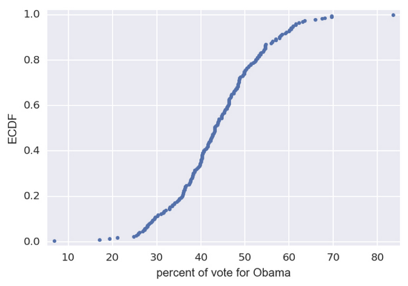
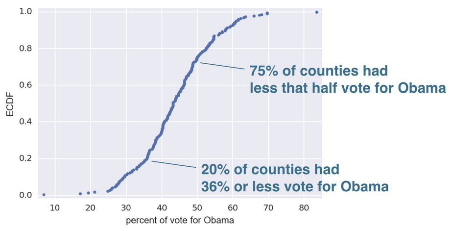
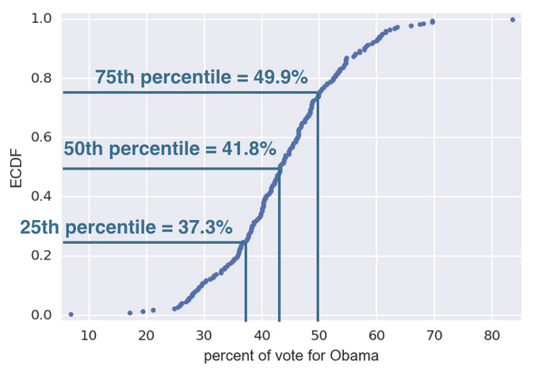

# Empirical cumulative distribution function

> aka ECDF

Example of **ECDF**



It allow us to see the percentage

* X-axis is the value we are measuring
* Y-axis is the ECDF, the percentage that correspond to x-axis value.



## Creating an ECDF plot

```python
x = np.sort(df["column_name"])
y = np.arange(1, len(x) + 1) /len(x)
plt.plot(x, y, marker=".", linestyle="none")
plt.xlabel("What we are measuring")
plt.ylabel("ECDF")
plt.margins(0.02)
plt.show()
```

We also can create ECDF for more than one data at a time

```python
# Compute ECDFs
x_set, y_set = ecdf(setosa_petal_length)
x_vers, y_vers = ecdf(versicolor_petal_length)
x_virg, y_virg = ecdf(virginica_petal_length)

# Plot all ECDFs on the same plot
plt.plot(x_set, y_set, marker=".", linestyle="none")
plt.plot(x_vers, y_vers, marker=".", linestyle="none")
plt.plot(x_virg, y_virg, marker=".", linestyle="none")

# Annotate the plot
plt.legend(('setosa', 'versicolor', 'virginica'), loc='lower right')
_ = plt.xlabel('petal length (cm)')
_ = plt.ylabel('ECDF')

# Display the plot
plt.show()
```


## Percentiles

We can identify the 25th, 50th (median) and 75th percentiles easily

```python
percentiles = np.percentiles(df["column_name"], [25,50,75])
```


