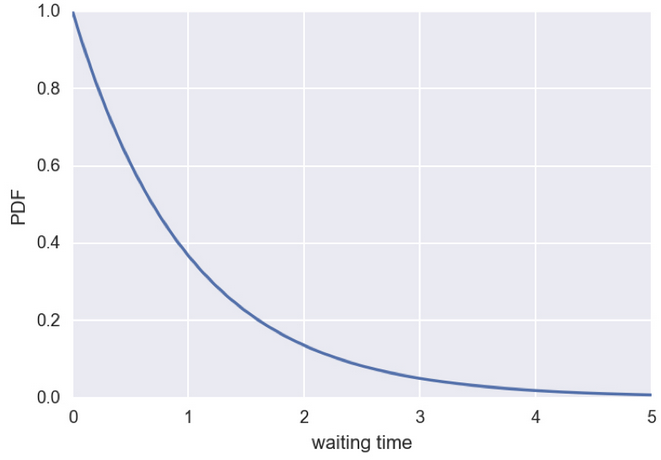
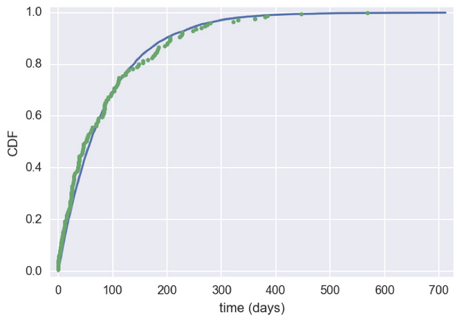

# Exponential Distributions

* The waiting time between arrivals of a Poisson distribution process is exponentially distributed.
* Timing of one is independent of all others



```python
mean = np.mean(data)
sample = np.random.exponential(mean, size=10000)
x_theor, y_theor = ecdf(sample)
x, y = ecdf(data)
plt.plot(x_theor, y_theor)
plt.plot(x, y, marker=".", linestyle="none")
plt.xlabel("time (days)")
plt.ylabel("CDF")
plt.show()
```



We can observe the distribution is close to exponential distribution
