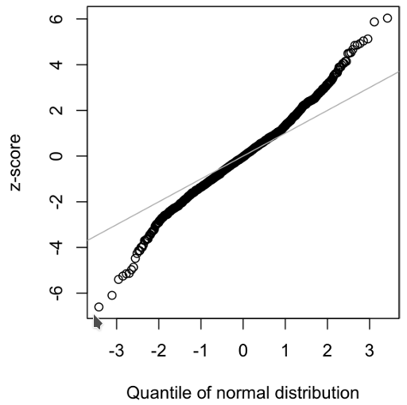

# Long Tail Distributions

* **Tail**, The long narrow portion of a frequency distribution, where relatively extreme values occur at low frequency.

* **Skew**, Where one tail of a distribution is longer than the other.

Sometimes the data ditribution is highly **skewed** (asymmetric), or the distribution can be discrete, as with binomial data. Both symmetric and asymmetric distributions may have  long tails. The tails of a distribution correspond to the extreme values (small and large). Long tails, and guarding against them, are widely recognized in practical work.

## Example

A good example to illustrate the long-tailed nature of data is stock returns. The QQ-Plot for the daily stock returns for Netflix (NFLX) is below.



R Code

```r
nflx  <-  sp500_px[,'NFLX']
nflx  <-  diff(log(nflx[nflx>0]))
qqnorm(nflx)
abline(a=0,  b=1,  col='grey')
```

Python Code

```python
nflx = sp500_px.NFLX
nflx = np.diff(np.log(nflx[nflx>0]))
fig, ax = plt.subplots(figsize=(4, 4))
stats.probplot(nflx,  plot=ax)
```

> The points below the line at the begining of the plot, and the ones above the line at the end of the line show that this is not a normal distribution.

> This means that we are much more likely to observe extreme values than would be expected if the data had a normal distribution.

> Another common phenomenon: the points are close to the line for the data within one standard deviation of the mean. Tukey refers to this phenomenon as data being “normal in the middle” but having much longer tails.

There is much statistical literature about the task of fitting statistical distributions to observed data. Beware an excessively datacentric approach to this job, which is as much art as science.  Data is variable, and often consistent, on its face, with more than one shape and type of distribution. It is typically the case that domain and statistical knowledge must be brought to bear to determine what type of distribution is appropriate to model a given situation. For example, we might have data on the level of internet traffic on a server over many consecutive five-second periods. It is useful to know that the best distribution to model “events per time period” is the Poisson.
