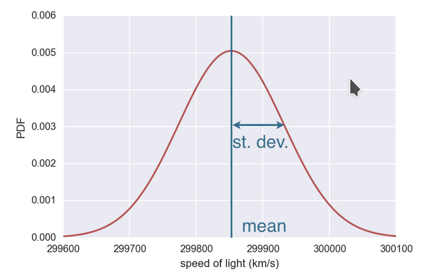
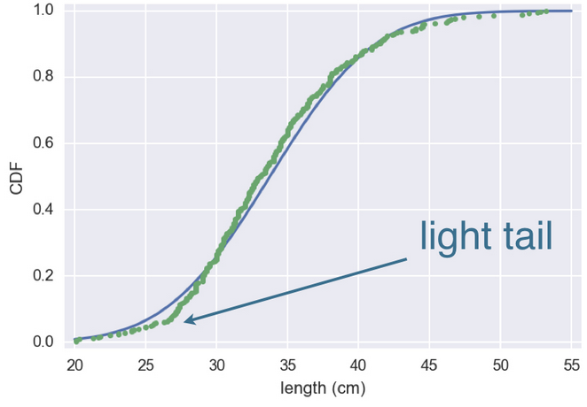

# Normal distribution

* Describes a continuous variable whose PDF has a single symetric peak.



There are two important parameters for the Normal distribution, **mean and standard deviation**, which are the top of the peak and how spread the data are.

In a normal distribution, 68% of the data lies within one standard deviation of the mean, and 95% lies within two standard deviations.


> The mean and standard deviation from the plot are not the same than the ones gotten from the data.

## Standarize

* Subtract the mean and divide by the standard deviation.

### z-score

* The result of standarizing an individual data point.

### Standard Normal

* A normal distribution with mean = 0 and standard deviation = 1.

A standard normal distribution is one in which the units on the x-axis are expressed in terms of standard deviations away from the mean. To compare data to a standard normal distribution, you subtract the mean and then divide by the standard deviation; this is also called normalization or standardization. The transformed value is termed a  z-score, and the normal distribution is sometimes called the **z-distribution**. 

A QQ-Plot is used to visually determine how close a sample is to a specified distribution—in this case, the normal distribution. The QQ-Plot orders the  z-scores from low to high and plots each value’s  z-score on the y-axis; the x-axis is the corresponding quantile of a normal distribution for that value’s rank. Since the data is normalized, the units correspond to the number of standard deviations away from the mean. If the points roughly fall on the diagonal line, then the sample distribution can be considered close to normal.

R Code

```r
norm_samp  <-  rnorm(100)
qqnorm(norm_samp) 
abline(a=0,  b=1,  col='grey')
```

Python Code

```python
fig, ax = plt.subplots(figsize=(4,  4))
norm_sample = stats.norm.rvs(size=100) 
stats.probplot(norm_sample, plot=ax)
```


QQ-Plot for a sample of 100 values randomly generated from a normal distribution; as expected, the points closely follow the line.

## Comparing Data vs PDF


So to execute the comparison

```python
mean = np.mean(data)
std = np.std(data)
sample = np.random.normal(mean, std, size = 10000)
x, y = ecdf(data)
x_theor, y_theor = ecdf(sample)

plt.plot(x_theor, y_theor)
plt.plot(x, y, marker=".", linestyle="none")
plt.xlabel("speed of light")
plt.ylabel("CDF")
plt.show()
```


## Warnings

### Distributions that look like normal, but they are not

This ditribution looks like normal distribution, but it's not.


Taking a look at CDF


It looks close normal distributed



But the light tail is a sign this is not normal distributed, but it would not be a big error if we treat it like a normal distribution.

Anyway, this is not normaly distributed


We can see that the mass is not normal distributed, even the length is.

Another key point is the lightness of the tails


> When modeling Normal distributions, outliers are extremely unlikely. So if there are outliers, normal distribution is not the best description for the data.
