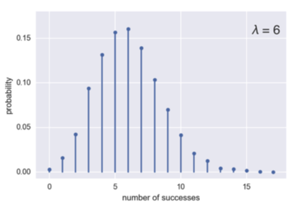
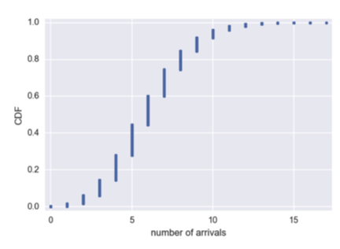

# Poisson distribution

* The timing of the next event is completly independent of when the previous event happend.
* Poisson distribution looks like Binomial distribution
* Poisson distribution is the limit of Binomial distribution for **low probability of success and a large number of Bernoulli trials** (rare events)
* Lambda (), it's the key parameter this is the:
  * **mean** number of events that occurs in a specific interval of time or space.
  * **variance**.

> A key assumption in any simulation study for either the Poisson or exponential distribution is that the rate, lambda , remains constant over the period being considered. This is rarely reasonable in a global sense; for example, traffic on roads or data networks varies by time of day and day of week. However, the time periods, or areas of space, can usually be divided into segments that are sufficiently homogeneous so that analysis or simulation within those periods is valid.

## Description

* The number of r arrivals of a **Poisson process** in **a given time interval** with average rate of **? arrivals** per interval is Poisson distributed.

### Example

* The number of r arrivals of **hits in a website** in **one hour** with average hit rate of **6 hits per hour** is Poisson distributed.

## Poisson PMF



## Poisson CDF

R code

```r
rpois(100, lambda=2)
```

Python code

```python
samples = np.random.poisson(6, size=10000)
x, y = ecdf(samples)
plt.plot(x, y, marker=".", linestyle="none")
plt.margins(0.02)
plt.xlabel("number of success")
plt.ylabel("CDF")
plt.show()
```

also

This code will generate 100 random numbers from a Poisson distribution with lambda = 2. For example, if incoming customer service calls average two per minute, this code will simulate 100 minutes, returning the number of calls in each of those 100 minutes.

```python
stats.poisson.rvs(2, size=100)
```



## Code

np.random.poisson(<!-- $\lambda$ --> , size='None')

Where
*  is the Expectation of interval, must be >= 0. A sequence of expectation intervals must be broadcastable over the requested size.
* size: Number of samples

```python
samples = np.random.poisson(6, size=10000)
```

## Related Distributions

* [Exponential Distribution](exponential_distributions.md) - The frequency distribution of the time or distance from one event to the next event.
* Weibull Distribution - A generalized version of the exponential distribution in which the event rate is allowed to shift over time.


## Estimating the Failure Rate

In many applications, the event rate, lambda , is known or can be estimated from prior data. However, for rare events, this is not necessarily so. Aircraft engine failure, for example, is sufficiently rare (thankfully) that, for a given engine type, there may be little data on which to base an estimate of time between failures. With no data at all, there is little basis on which to estimate an event rate. However, you can make some guesses: if no events have been seen after 20 hours, you can be pretty sure that the rate is not 1 per hour. Via simulation, or direct calculation of probabilities, you can assess different hypothetical event rates and estimate threshold values below which the rate is very unlikely to fall. If there is some data but not enough to provide a precise, reliable estimate of the rate, a goodness-of-fit test can be applied to various rates to determine how well they fit the observed data.
