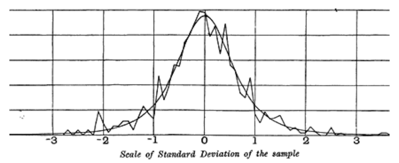

# Student's t-Distribution

The  **t-distribution  is a normally shaped distribution, except that it is a bit thicker and longer on the tails**.  It is used extensively in depicting distributions of sample statistics. Distributions of sample means are typically shaped like a t-distribution, and there is a family of t-distributions that differ depending on how large the sample is. The larger the sample, the more normally shaped the t-distribution becomes.

* **n** , sample sie
* **Degrees of freedom** is a parameter that allows the t-distribution to adjust to different sample sizes, statistics, and numbers of groups.

A number of different statistics can be compared, after standardization, to the tdistribution, to estimate confidence intervals in light of sampling variation. Consider a sample of size  n  for which the sample mean x has been calculated. If  s  is the sample standard deviation, a 90% confidence interval around the sample mean is given by:

<!-- $\bar{x} \pm t_{n-1}(0.05) * \frac{s}{\sqrt{n}}$ --> 

Where: 

*  is the value of the t-statistic, with (n-1) degrees of freedom,  that “chops off” 5% of the t-distribution at either end.
